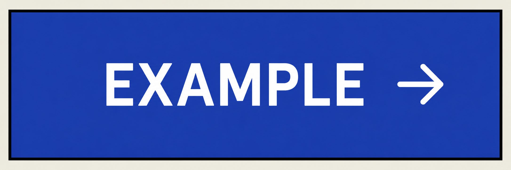
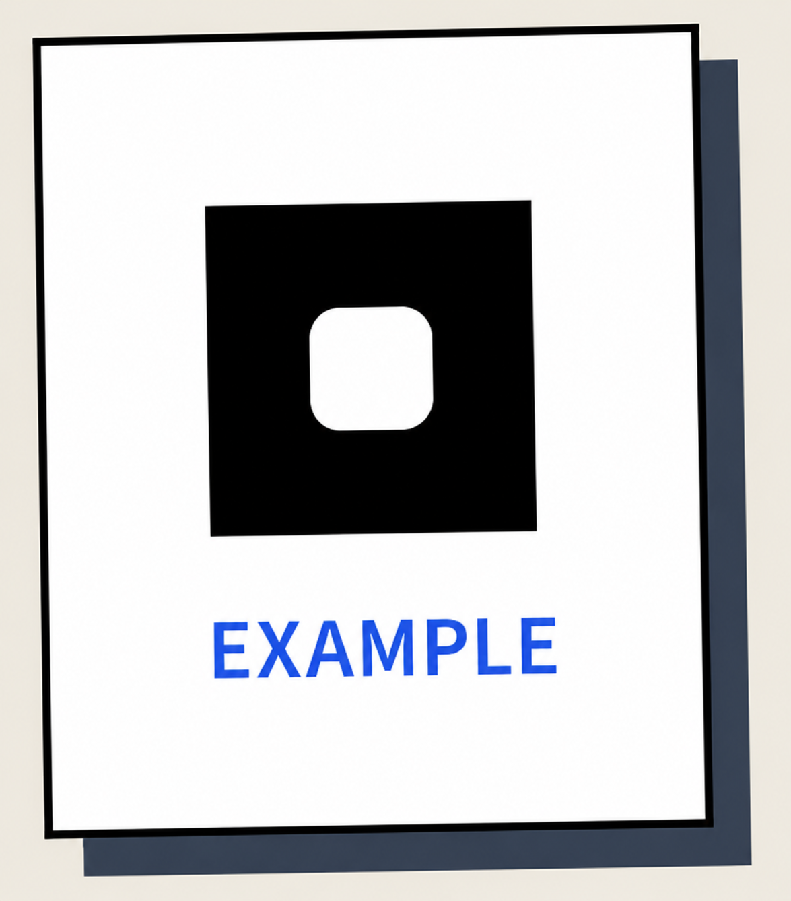
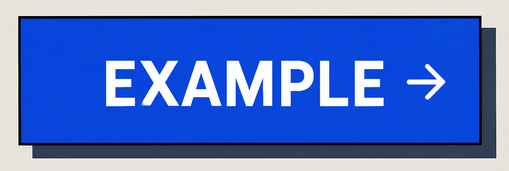
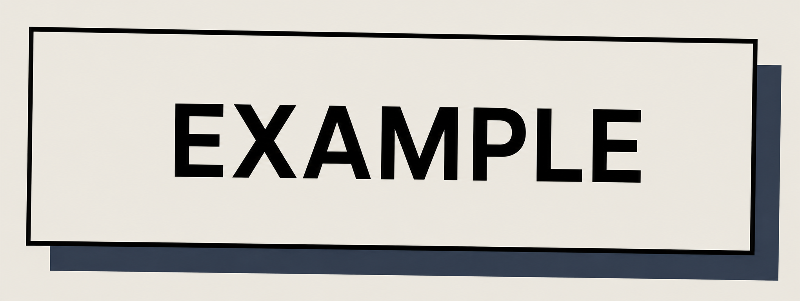
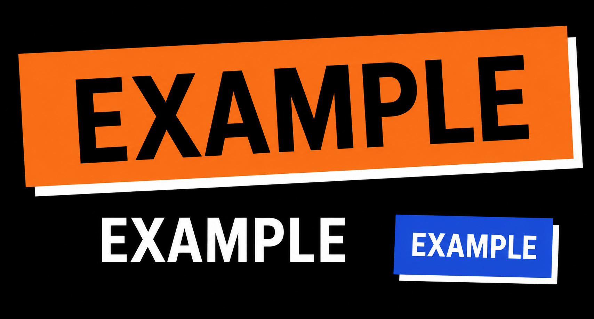
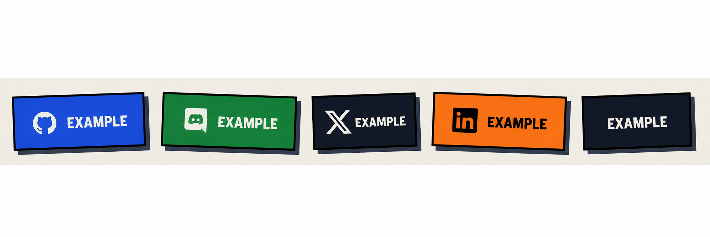
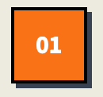
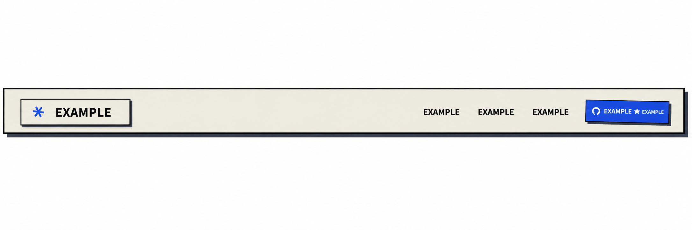
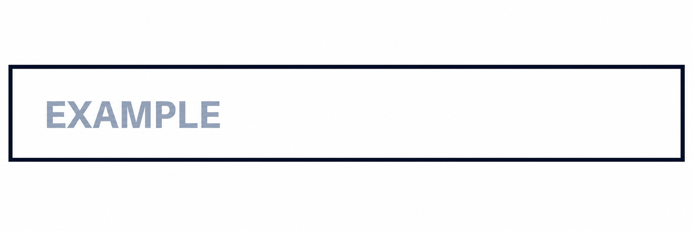

# CreatorOS Complete Design System & Specification

> **CRITICAL INSTRUCTION**
> When asked to "design", "build", or "redesign" ANY page or component for CreatorOS, you **MUST** strictly adhere to every single detail, variable, pixel offset, and structural paradigm in this document. Do not use generic components, default Bootstrap, or standard modern web styling. 
> **You are building an exact, uncompromising, neo-brutalist interface.**

---

## 1. The Core Aesthetic Paradigm
The CreatorOS aesthetic is "Neo-Brutalism". It mimics a physical, punchy, high-contrast scrapbook. Elements feel like thick cardboard cutouts with raw, unapologetic styling.

**Absolute Rules:**
1. **Zero Border Radius:** Every element, button, input, and card MUST have `border-radius: 0;` or `rounded-none`. No exceptions.
2. **Hard Shadows Only:** Drop shadows are NEVER blurred. They are solid blocks of color.
3. **Thick Borders:** Every container uses a `2px` or `4px` solid black border.
4. **Physical Interactivity:** Elements shift position in 2D space when hovered or pressed, with shadows expanding or collapsing accordingly.
5. **Intentional Misalignment:** Heavy use of playful rotations (`-2deg`, `1deg`, `12deg`) to break up the rigid grid.

---

## 2. Global Variables & Master Color Palette

Every stylesheet MUST use these precise variables and colors.

```css
:root {
    /* 1. Base & Neutrals */
    --base-100: #F8F9FA;   /* Main application background (off-white) */
    --base-600: #4B5563;   /* Muted text */
    --base-700: #374151;   /* Sub-headings and secondary text */
    --base-800: #1F2937;   /* Darker text */
    --base-900: #111827;   /* Almost black backgrounds */
    --black: #000000;      /* Primary text, borders, default shadows */
    --white: #FFFFFF;      /* High contrast card backgrounds */
    
    /* 2. Vibrant Accent Colors */
    --accent-500: #4338CA; /* Primary Indigo. Used for main CTAs, highlights */
    --accent-600: #3730A3; /* Hover state for primary buttons */
    --warning-500: #F59E0B; /* Primary Orange/Yellow. Used for secondary CTAs, badges */
    --warning-600: #D97706; /* Hover state for warning elements */
    --success-500: #10B981; /* Green. Used for positive states and decorative blocks */
    --success-600: #059669; /* Hover state for success elements */
    --danger-500: #EF4444;  /* Red. Used for destructive actions and hover warnings */
    
    /* 3. Shadow System */
    --shadow-ink: var(--black); /* Default shadow color, can be swapped for white on dark bg */
    --shadow-sm: 3px 3px 0px 0px var(--shadow-ink);
    --shadow-md: 4px 4px 0px 0px var(--shadow-ink);
    --shadow-lg: 6px 6px 0px 0px var(--shadow-ink);
    --shadow-xl: 8px 8px 0px 0px var(--shadow-ink);
    --shadow-xxl: 9px 9px 0px 0px var(--shadow-ink);
    
    /* 4. Border System */
    --border-base: 2px solid var(--black);
    --border-thick: 4px solid var(--black);
}

body {
    background-color: var(--base-100);
    color: var(--black);
    /* For custom scrollbars, use 'scrollbar-hide' utility if needed, but no soft scrollbars */
}
```

---

## 3. Typography System in Detail

Import these exact Google Fonts:
`<link href="https://fonts.googleapis.com/css2?family=Petrona:ital,wght@0,400;0,600;0,700;1,400&family=Source+Sans+3:ital,wght@0,400;0,500;0,600;0,700;1,400&family=Azeret+Mono:wght@400;600&display=swap" rel="stylesheet">`

### 3.1 Display & Headings (`.font-display`, `.font-serif`)
* **Font Family:** `'Petrona', serif`
* **Weights:** `600` (Semi-Bold), `700` (Bold)
* **Hero Titles (`h1`):** `text-4xl` up to `text-7xl` or `text-8xl`.
* **Line Height:** Extremely tight. `leading-[0.9]` or `leading-[0.98]`.
* **Tracking:** Tight. `tracking-tight`.
* **Usage:** Section titles, hero headers.

### 3.2 Body & Paragraphs (`.font-sans`)
* **Font Family:** `'Source Sans 3', sans-serif`
* **Weights:** `400` (Regular), `500` (Medium), `600` (Semi-Bold).
* **Line Height:** Relaxed for readability. `leading-[1.65]` or `leading-relaxed`.
* **Opacity Variants:** When used inside colored cards, text should be `text-black/80` or `text-white/85`.
* **Usage:** Standard text, descriptions, subtext.

### 3.3 Labels & Buttons (`.font-label`)
* **Font Family:** `'Azeret Mono', monospace`
* **Weights:** `400` (Regular), `600` (Bold)
* **Styling:** ALWAYS `uppercase`, `tracking-wide` (letter spacing), often `text-xs`, `text-sm`, or `text-base`.
* **Usage:** Navigation links, button text, badges, numbered steps (e.g., "01").

---

## 4. Neo-Brutalist Interaction Physics

The interaction model is highly specific. When hovering, elements don't just change color; they move on the X/Y axes and their solid shadows expand. 

### Standard Hover Sequence

1. **Default State:** Element has `shadow-[4px_4px_0_var(--shadow-ink)]` and is static (or has a slight rotation like `rotate-[-1deg]`).
   
   

2. **Hover State (`:hover`):** 
   * Move the element UP and LEFT: `translate-x-[-2px] translate-y-[-2px]` (sometimes up to `-3px`).
   * Expand the shadow: `shadow-[6px_6px_0_var(--shadow-ink)]` or `shadow-[8px_8px_0_var(--shadow-ink)]`.
   * Snap rotation to `0deg` (e.g., `hover:rotate-0`).
   
   

3. **Active/Click State (`:active`):** 
   * Move the element DOWN and RIGHT past its origin: `translate-x-[2px] translate-y-[2px]`.
   * Remove or shrink the shadow entirely: `shadow-none`.
   
   

*Transition Timing:* `transition-all duration-150` or `duration-200`. No slow fades.

---

## 5. Component Level Specifications

### 5.1 Primary Buttons (The "Action" Button)



* **Structure:** Thick rectangle (`h-13`, `px-6`, `py-3`).
* **Border:** `1px` or `2px` solid black.
* **Background:** `var(--accent-500)`.
* **Text:** `var(--white)`, `.font-label`, `uppercase`, `tracking-wide`, `font-medium`.
* **Default Rotation:** Often slightly off-kilter (`rotate-[-1deg]`).
* **Hover:** Snaps to `rotate-0`, moves `-1px` or `-2px`, shadow grows from `6px` to `8px`. Background shifts to `var(--accent-600)`.

### 5.2 Secondary/Ghost Buttons



* **Background:** `transparent` or `var(--white)`.
* **Text:** `var(--black)`.
* **Hover:** Background changes to `var(--black)` and text to `var(--white)`, or background changes to `var(--warning-500)` with black text.

### 5.3 Highlight Spans (In-text Badges)



Used inside `h1` or `h2` elements to draw extreme attention.
* **Style 1 (Standard):** `bg-accent-500 text-white px-2 inline-block rotate-1 shadow-[4px_4px_0_var(--shadow-ink)]`.
* **Style 2 (Dark):** `bg-black text-white px-2 inline-block -rotate-1`.
* **Style 3 (Warning):** `bg-warning-500 text-black px-3 inline-block rotate-[2deg] shadow-[4px_4px_0_var(--shadow-ink)]`.

### 5.4 Feature Cards & Sponsor Blocks



* **Border:** `2px border-black`.
* **Padding:** `p-6 md:p-8` or `p-8 sm:p-10`.
* **Shadow:** `shadow-[6px_6px_0px_0px_var(--shadow-ink)]`.
* **Hover Physics:** `hover:-translate-x-[3px] hover:-translate-y-[3px] hover:shadow-[9px_9px_0px_0px_var(--shadow-ink)] hover:rotate-[-1deg]`.
* **Colors:** Cycle backgrounds between `accent-500`, `warning-500`, `success-500`, and `base-900`. Note that inside `base-900` or `accent-500` cards, text MUST be `text-base-100` (white) for contrast.

### 5.5 Step Number Badges (e.g., 01, 02)



* **Structure:** Perfect square (`w-12 h-12`).
* **Style:** `border-2 border-black bg-warning-500 flex items-center justify-center shadow-[3px_3px_0px_0px_var(--shadow-ink)]`.
* **Text:** `.font-label text-base text-white font-bold`.

### 5.6 Navbar (Top Fixed)



* **Wrapper:** `fixed top-0 left-0 right-0 z-30 py-4 px-3 md:px-6 transition-transform duration-300`. (Hides on scroll down, shows on scroll up using translateY).
* **Inner Box:** `max-w-screen-xl mx-auto bg-base-100 border-2 border-black shadow-[6px_6px_0px_0px_var(--shadow-ink)] px-5 py-3 md:px-8 md:py-4`.
* **Nav Links:** `.font-sans text-base font-medium text-black px-3 py-2 border-2 border-transparent hover:border-black hover:text-accent-500 hover:bg-accent-500/10 transition-all`.
* **Logo Hover Interaction:** `group-hover:rotate-[-2deg] group-hover:shadow-[4px_4px_0_var(--shadow-ink)]`.

### 5.7 Form Inputs



* **Inputs:** `border: var(--border-base); background: var(--white); padding: 1rem; font-family: 'Source Sans 3', sans-serif; border-radius: 0;`
* **Focus State:** `box-shadow: var(--shadow-sm); outline: 2px solid var(--accent-500); outline-offset: 2px; transform: translate(-1px, -1px);`

---

## 6. Section & Layout Blueprints

### 6.1 Hero Section
* **Grid:** 2-column layout (`grid-cols-1 lg:grid-cols-2`). Text on left, massive illustration/graphic on right.
* **Heading:** Multi-line `h1` using `.font-display`, featuring at least one rotated Highlight Span (see 5.3).
* **Buttons:** A row of buttons wrapped in `flex flex-wrap gap-4`. Primary CTA on the left, Secondary/GitHub button on the right.

### 6.2 "The Pain / The Problem" Section (About)
* **Structure:** Image on the left, vertical list of 3 steps on the right.
* **Title:** Heavy use of strikethrough for irony. Example: `The <span class="line-through decoration-4">joy</span> <span class="bg-accent-500 text-white px-2 -rotate-1 inline-block shadow-[4px_4px_0_var(--shadow-ink)]">pain</span> of manually editing...`
* **Step Items:** Flex container with the Step Number Badge (5.5) and a `.font-serif` title.

### 6.3 Dark Mode / Inverse CTA Section
* **Container:** Massive block with `bg-black border-4 border-black p-6 md:p-10 lg:p-16 z-10`.
* **Typography:** `text-white`.
* **Shadows:** Inside this dark block, shadows use white ink: `shadow-[4px_4px_0_white]`.
* **Inverse Highlight:** `bg-warning-500 text-black px-4 inline-block origin-center shadow-[6px_6px_0_white]`.
* **Dividers:** Use `h-[2px] bg-white/30` with `OR` text in the center.

---

## 7. Decorative Elements & Flair

1. **Floating Abstract Shapes:** Place absolute positioned blocks randomly behind main sections to break the grid.
   * *Example:* `<div class="absolute -top-6 -left-6 w-24 h-24 bg-warning-500 border-2 border-black rotate-12 shadow-[4px_4px_0_var(--shadow-ink)]"></div>`
2. **Strikethrough Emphasis:** Do not just cross things out. Use thick lines: `line-through decoration-4` or `decoration-warning-500`.
3. **Icons:** SVG icons inside buttons should be thick stroke (`stroke-width="2"`) and scale to `w-5 h-5` or `w-6 h-6`. Sometimes icons are inverted (`invert` class) when placed on dark background buttons.

---

## AI PROMPT INJECTION SUMMARY
**If you are an AI generating code based on this file:**
You are forbidden from using `border-radius`. Every element is a sharp square or rectangle. You are forbidden from using blurred shadows (`box-shadow: 0 4px 6px rgba(...)`). Every border must be solid black (`2px` or `4px`). Every shadow must be a sharp offset (`4px 4px 0px 0px #000`). You MUST incorporate tactile hover physics (`translate-x-[-2px] translate-y-[-2px]` with shadow expansion). Use `Petrona` for displays, `Source Sans 3` for body text, and `Azeret Mono` for uppercase labels. Use `bg-accent-500`, `bg-warning-500`, and `bg-success-500` aggressively. Follow these exact pixel values, transitions, and HTML structure rules flawlessly to output a perfect neo-brutalist UI.
